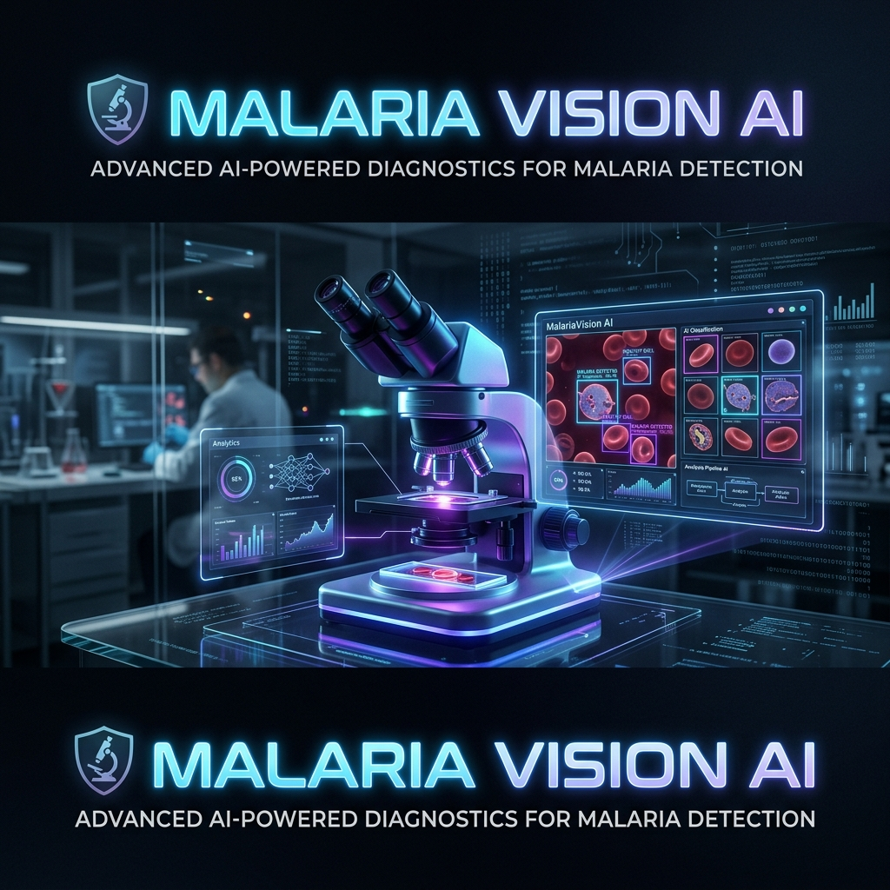

<div align="center">
  
  
  # MalariaVision AI 🔬
  
  
  
  
  
  
  *An intelligent, full-stack object detection pipeline that identifies and highlights malaria parasites in full microscope slide imaging.*
</div>


## Overview
This repository contains the end-to-end MLOps pipeline for a Malaria Cell Detection AI. It transitioned from a basic single-cell Keras classifier to a state-of-the-art YOLOv8s object detector coupled with a beautiful, responsive web interface.

## Tech Stack
* **Deep Learning Framework:** Ultralytics (YOLOv8s) + PyTorch (Apple Silicon MPS Acceleration)
* **Backend:** FastAPI, Python, OpenCV (Headless with `libGL` system bindings)
* **Frontend:** Vanilla HTML/CSS/JS with Dark Mode Glassmorphism & Reactive Bounding Box Scaling
* **Containerization:** Docker (optimized for unprivileged user execution and system C++ libraries)
* **Deployment Provider:** Hugging Face Spaces
* **CI/CD:** GitHub Actions & Pytest

## Project Structure
* `best.pt`: The fine-tuned YOLOv8 custom weights trained on the malaria dataset.
* `app.py`: FastAPI server handling image processing and YOLO inference.
* `static/`: Contains the frontend assets (UI and dynamic bounding box engine).
* `prepare_yolo_data.py`: Preprocessing script converting raw `training.json` annotations to YOLO normalization formats.
* `requirements.txt`: Lightweight production dependencies.
* `Dockerfile`: Container configuration configured specifically for Hugging Face security constraints and OpenCV C++ bindings.

## How to Run Locally
1. Install dependencies: `pip install -r requirements.txt`
   *(Note: Ensure your code editor's interpreter points to your ML environment).*
2. Start the server: `uvicorn app:app --reload`
3. Access the Web GUI: Navigate to `http://localhost:8000` in your browser.

## Training on Apple Silicon (Mac)
If you wish to retrain the model on an M-series Mac, use the following memory-optimized command to prevent Unified Memory swap overflows:
```bash
yolo task=detect mode=train model=yolov8s.pt data=dataset.yaml epochs=100 patience=20 imgsz=640 device=mps batch=4
```
**Handling PyTorch Memory Leaks:** If the training exponentially slows down after several hours (e.g., jumping from 10 minutes per epoch to 2+ hours), PyTorch has encountered a caching memory leak. Kill the process (`Ctrl+C`), close the terminal to flush the RAM, and run the following to resume at full speed:
```bash
yolo task=detect mode=train resume=True model=runs/detect/train/weights/last.pt device=mps batch=4
```

## Training on Windows/Linux (NVIDIA GPU)
If you are moving this repository to a dedicated deep learning PC, ensure you have an NVIDIA GPU (AMD GPUs do not natively support CUDA).
Use the following command to leverage the raw power of the Nvidia GPU (Notice `device=0`):
```bash
yolo task=detect mode=train model=yolov8m.pt data=dataset.yaml epochs=200 patience=30 imgsz=800 device=0 batch=16
```
**Handling CUDA Out Of Memory (OOM):** Unlike Apple Silicon, which smoothly slows down when running out of memory (via SSD swapping), Windows/Linux NVIDIA GPUs will instantly trigger a fatal crash labeled `RuntimeError: CUDA out of memory`. If this occurs, simply lower the `batch` size (e.g., from `16` to `8`) and rerun the command to physically fit the arrays back inside your specific GPU's isolated VRAM limits.
